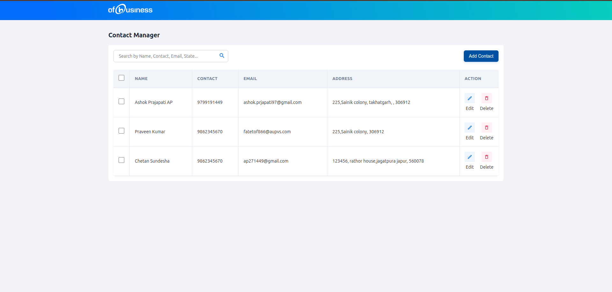
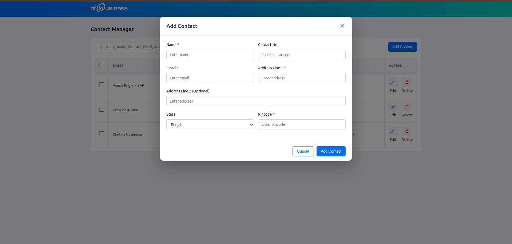
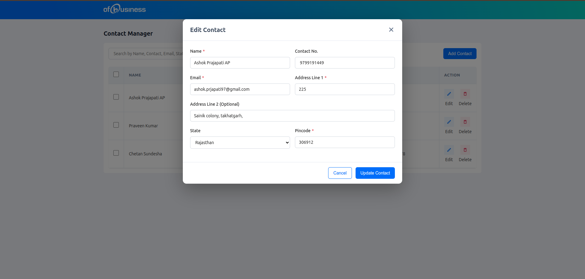
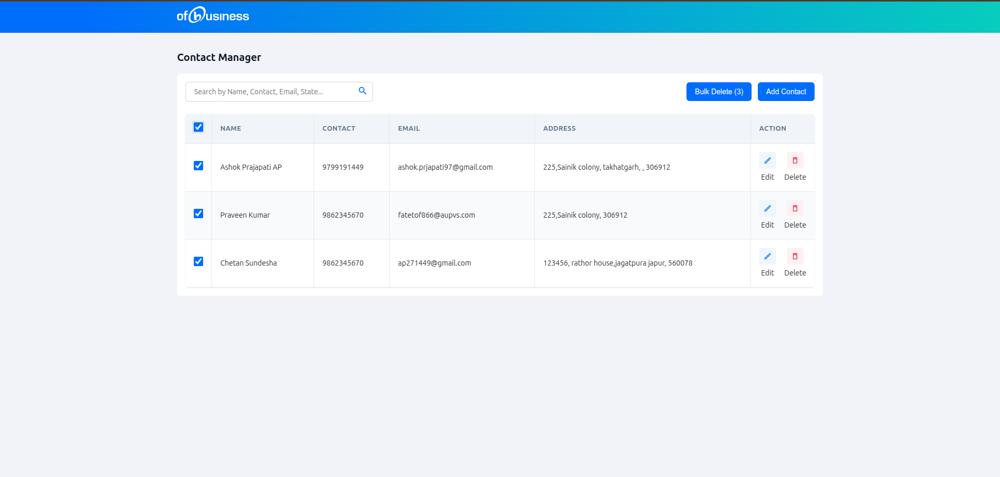
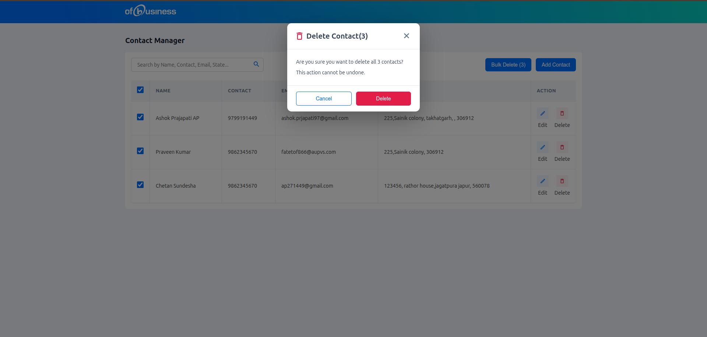

# Contact Manager

A modern, responsive contact management application built with React, TypeScript, and Redux Toolkit. This application provides a complete solution for managing contacts with persistent local storage, intuitive user interface, and comprehensive CRUD operations.

## 🚀 Features

- **Add New Contacts**: Create contacts with comprehensive information
- **Edit Existing Contacts**: Update contact information seamlessly
- **Delete Contacts**: Remove individual contacts or perform bulk deletions
- **Real-time Search**: Search contacts by name, email, phone, or address
- **Local Storage**: Automatic data persistence between browser sessions
- **Redux State Management**: Efficient and predictable state management
- **Sticky Navigation**: Header remains visible while scrolling
- **Bulk Operations**: Multi-select functionality for batch operations

## 🛠️ Tech Stack

- **Frontend**: React 19.2.0
- **Language**: TypeScript
- **State Management**: Redux Toolkit 2.11.0
- **Build Tool**: Vite
- **Styling**: CSS with modular architecture
- **Linting**: ESLint
- **Data Persistence**: Local Storage with custom hooks

## 📦 Installation & Setup

### Prerequisites

- **Node.js** (version 14 or higher)
- **npm** or **yarn** package manager

### Installation Steps

1. **Clone the repository**

   ```bash
   git clone https://github.com/AshokPrjapati/contact-manager.git
   cd contact-manager
   ```

2. **Install dependencies**

   ```bash
   npm install
   ```

3. **Start the development server**

   ```bash
   npm run dev
   ```

4. **Open your browser**
   - Navigate to `http://localhost:5173`
   - The application will start with an empty contact list

### Available Scripts

```bash
npm run dev      # Start development server (Vite)
npm run build    # Build for production
npm run preview  # Preview production build locally
npm run lint     # Run ESLint for code quality
```

## 📱 User Interface Screenshots

### Main Dashboard


_The main dashboard showing the contact table with search functionality, bulk operations, and responsive layout_

### Add Contact Form


_Modal form for adding new contacts with validation and required field indicators_

### Edit Contact


_Contact editing interface with pre-populated form data for seamless updates_

### Bulk Selection & Delete


_Multi-select interface showing selected contacts with bulk delete option_

### Bulk Delete Confirmation


_Confirmation modal for bulk delete operations with count display_

### Single Delete Confirmation


_Individual contact delete confirmation with clear action buttons_

## 💡 Usage Guide

### Adding a New Contact

1. Click the **"Add Contact"** button in the top-right corner
2. Fill in the required information:
   - **Name\*** (required)
   - **Phone\*** (required, digits only)
   - **Email\*** (required, valid format)
   - **Address Line 1\*** (required)
   - Address Line 2 (optional)
   - **State\*** (required)
   - **Pincode\*** (required)
3. Click **"Save Contact"** to add

### Editing a Contact

1. Click the **edit icon** (pencil) next to any contact
2. Modify the information in the modal form
3. Click **"Save Contact"** to update

### Deleting Contacts

**Single Contact:**

1. Click the **delete icon** (trash) next to any contact
2. Confirm deletion in the popup modal

**Bulk Delete:**

1. Select multiple contacts using checkboxes
2. Click **"Bulk Delete (X)"** button
3. Confirm the bulk deletion

### Searching Contacts

1. Use the search bar at the top of the contact list
2. Type any part of name, email, phone, or address
3. Results filter in real-time as you type

## 🗂️ Project Structure

```
src/
├── app/                    # Redux store configuration
│   ├── store.ts           # Store setup and configuration
│   └── hooks.ts           # Typed Redux hooks (useAppDispatch, useAppSelector)
├── components/            # React UI components
│   ├── ContactList.tsx    # Main contact list with table and actions
│   ├── ContactModal.tsx   # Add/Edit contact modal form
│   ├── DeleteConfirmModal.tsx # Delete confirmation dialog
│   └── Nav.tsx           # Sticky navigation header
├── features/             # Feature-based organization
│   └── contacts/         # Contact management feature
│       ├── contactSlice.ts # Redux slice with actions and reducers
│       ├── selectors.ts   # State selectors
│       ├── types.ts      # TypeScript interfaces
│       └── index.ts      # Barrel exports
├── hooks/                # Custom React hooks
│   ├── useLocalStorage.ts # Local storage persistence hook
│   └── index.ts          # Hook exports
├── styles/               # Modular CSS files
│   ├── button.css        # Button component styles
│   ├── control.css       # Form control styles
│   ├── form.css          # Form layout styles
│   ├── modal.css         # Modal dialog styles
│   └── table.css         # Table component styles
├── utils/                # Utility functions
│   └── validation.ts     # Form validation logic
├── App.tsx              # Root application component
├── main.tsx             # Application entry point
└── index.css            # Global styles and CSS variables
```

## ⚙️ Data Model

```typescript
interface Contact {
  id: string; // Unique identifier (timestamp-based)
  name: string; // Full name (required)
  phone: string; // Phone number (required, digits only)
  email: string; // Email address (required, validated)
  addressLine1: string; // Primary address (required)
  addressLine2?: string; // Secondary address (optional)
  state: string; // State/Province (required)
  pincode: string; // Postal/ZIP code (required)
}
```

## 🔧 Assumptions & Design Decisions

### Assumptions

1. **Single User Application**: Designed for individual use without authentication
2. **Local Data Storage**: Uses browser localStorage for data persistence
3. **Basic Contact Information**: Focused on essential contact fields
4. **Modern Browser Support**: Requires browsers with localStorage and ES6+ support

### Design Decisions

1. **Redux Toolkit**: Chosen for predictable state management and excellent DevTools
2. **TypeScript**: Full type safety for better development experience and fewer bugs
3. **Component Architecture**: Feature-based organization for scalability
4. **CSS Modules**: Modular styling approach for maintainability
5. **Local Storage**: Simple persistence solution suitable for single-user applications
6. **Responsive Design**: Mobile-first approach with CSS Grid and Flexbox

## ⚠️ Known Limitations

### Storage Limitations

- **Storage Size**: Limited by browser's localStorage quota (~5-10MB)
- **Data Format**: JSON serialization (no binary data support)
- **Persistence**: Data survives page refresh but not browser data clearing

## 🚀 Future Enhancements

### Planned Improvements

- [ ] **Backend Integration**: REST API for data synchronization
- [ ] **User Authentication**: Multi-user support with secure login
- [ ] **Cloud Storage**: Database persistence with backup capabilities
- [ ] **Import/Export**: CSV, vCard support for data portability
- [ ] **Contact Photos**: Profile picture upload and management
- [ ] **Categories/Tags**: Contact grouping and organization
- [ ] **Advanced Search**: Filters, sorting, and complex queries
- [ ] **Mobile App**: React Native version for mobile platforms
- [ ] **Offline Support**: Service worker for offline functionality
- [ ] **Contact Sharing**: Share contacts between users

### Technical Improvements

- [ ] **Unit Testing**: Comprehensive test suite with Jest/RTL
- [ ] **E2E Testing**: Cypress integration for user workflow testing
- [ ] **Performance**: Virtual scrolling for large contact lists
- [ ] **Accessibility**: Enhanced ARIA support and keyboard navigation
- [ ] **PWA Features**: Install prompt and offline capabilities

## 🧪 Development

### Code Quality

- **TypeScript**: Strict mode enabled for maximum type safety
- **ESLint**: Configured with React and TypeScript best practices
- **Component Patterns**: Functional components with hooks
- **State Management**: Centralized Redux store with typed actions
- **Error Handling**: Graceful error boundaries and validation

### Running in Development

```bash
# Start development server with hot reload
npm run dev

# Build and preview production version
npm run build && npm run preview

# Run linting
npm run lint
```

## 🤝 Contributing

1. Fork the repository
2. Create a feature branch (`git checkout -b feature/amazing-feature`)
3. Commit your changes (`git commit -m 'Add some amazing feature'`)
4. Push to the branch (`git push origin feature/amazing-feature`)
5. Open a Pull Request

### Development Guidelines

- Follow TypeScript best practices
- Maintain existing code style and patterns
- Add appropriate error handling
- Update documentation for new features
- Test thoroughly before submitting

**Built with ❤️ using React, TypeScript, and Redux Toolkit**
